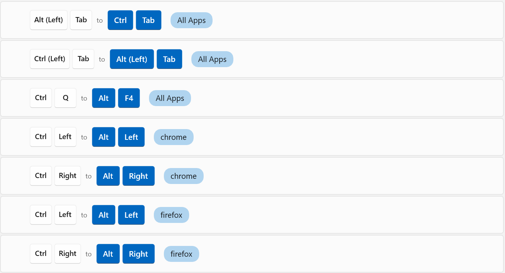

# Dotfiles for Windows

In some sense based on my dotfiles for MacOS and Ubuntu, but for Powershell/Windows terminal.

# Setting up a new machine

Everything here is assumed to be run in Powershell (Core) in Windows Terminal unless stated otherwise. Also, let's try to stay away from running as Administrator for as much as possible.

## Apps that needs to be manually downloaded

- Windows terminal
- Rider
- Spotify
- Docker
- PowerToys

## Let's go!

1. Create a `.gitconfig.local` in this folder and add:
   ```
   [user]
       useConfigOnly = true
       email = <email>
       name = <name>
   ```
1. Read and run `setup-new-machine.ps1`
1. Run `sudo symlink-setup.ps1`

## What you get

- `scoop`
- `chocolatey`
- `nvm`
- oh-my-posh themed terminal with `ys` theme
- `z` for quickly jumping between folders
- history search based on previous commands
- aliases

## Keymap

I've just used Mac for too long, I have to reverse map Ctrl/Alt keys so that Alt (key closest to Space) behaves like Ctrl/CMD.

So for me `Alt+1` switches to first tab in VSCode/Chrome/Terminal, `Alt+S` saves a document etc, but `Alt+Tab` still works to tab between windows.


